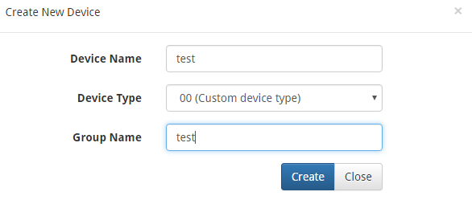
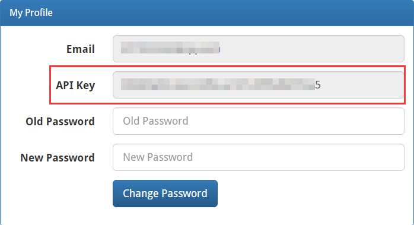
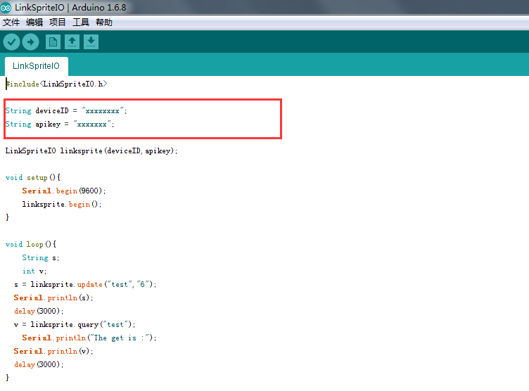
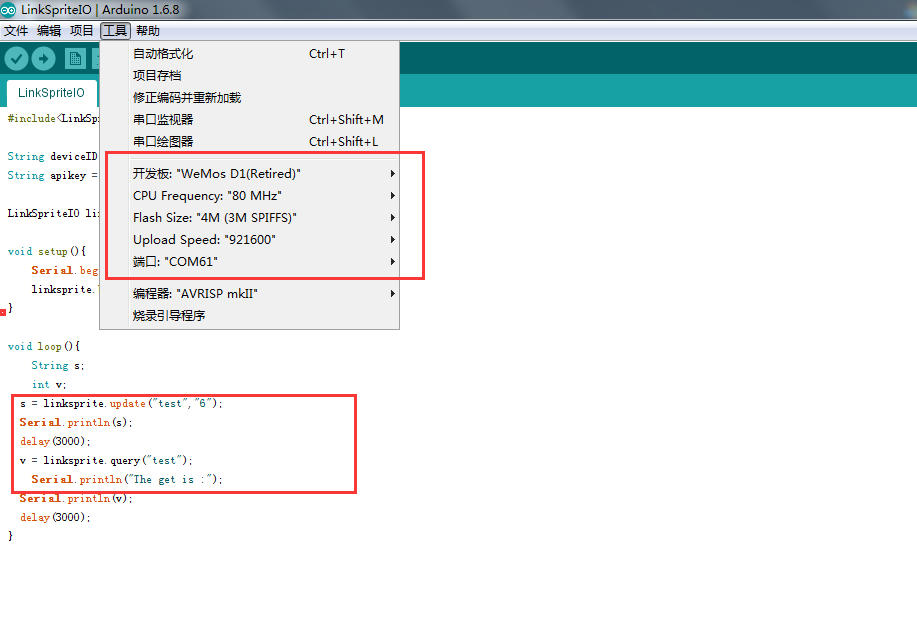
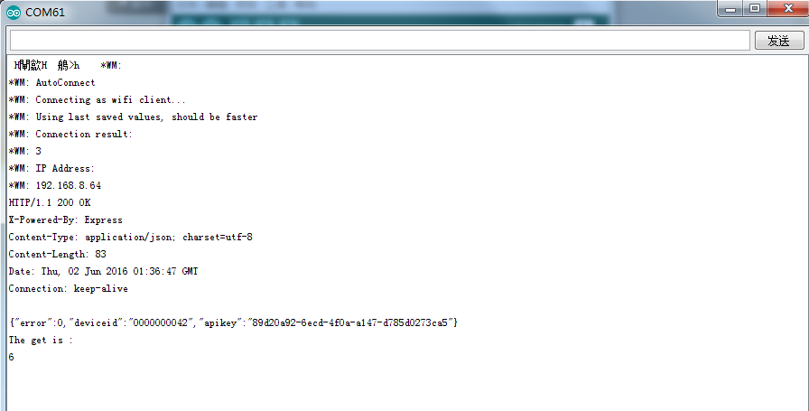
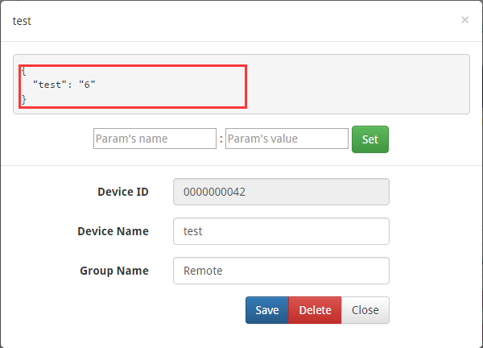
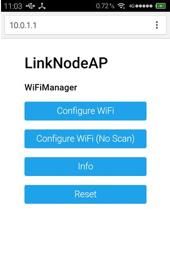

### 如何让LinkNode D1连接上云平台

### 准备材料
* LinkNode D1 x 1
* 具有wifi AP的设备 x 1 

### 具体步骤
##### 1.注册登录linksprite.io
网页登录www.linksprite.io注册一个账号，并登录，在自己的账号下面建一个DIY设备，设备类型为00(Custom device type),设备名和设备分组可以随便。

* 注册[www.linksprite.io](www.linksprite.com)
* 登录此账号  
* 创建一个设备，设备编号为00，设备名和设备分组可以自己DIY。 

* 获取设备的deviceID

* 获取设备的apikey

##### 2.下载并运行代码
* 下载源文件
`git clone https://github.com/delongqilinksprite/LinkSpriteIO.git`
* 将下载的代码放到Arduino IDE目录下的libraries目录下
* 打开Arduino IDE 
* 打开 文件->示例->LinkSpriteIO->LinkSpriteIO
* 修改代码中的deviceID和apikey
* 配置LinkNode D1工程环境
* 编译上传程序  
* 打开串口和www.linksprite.io观察现象

* 修改代码中的deviceID和apikey  
  
* 配置LinkNode D1工程环境  

* 串口数据  

* www.linksprite.io数据  
  
到这里我们可以看到我们可以把我们的数据上传到Linksprite.io云平台上了，也从云平台将数据拿来下来。
#### 备注
初次使用LinkNode D1开发板时wifi需要配置，LinkNode D1会发出一个名字为LinkNode AP的wifi，密码为12345678，用手机连接wifi，输入10.0.1.1配置wifi  

